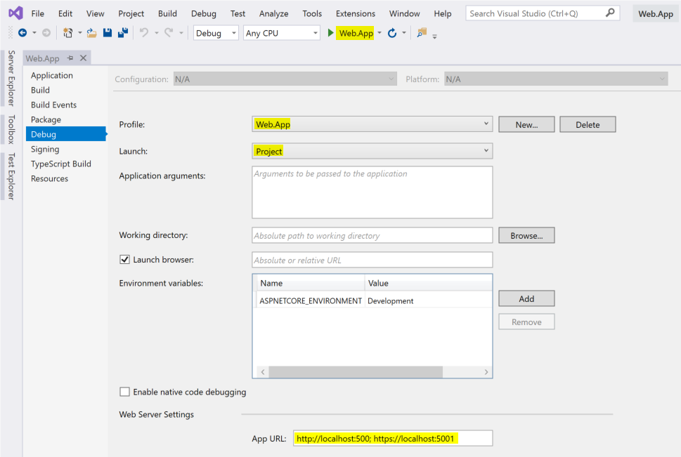
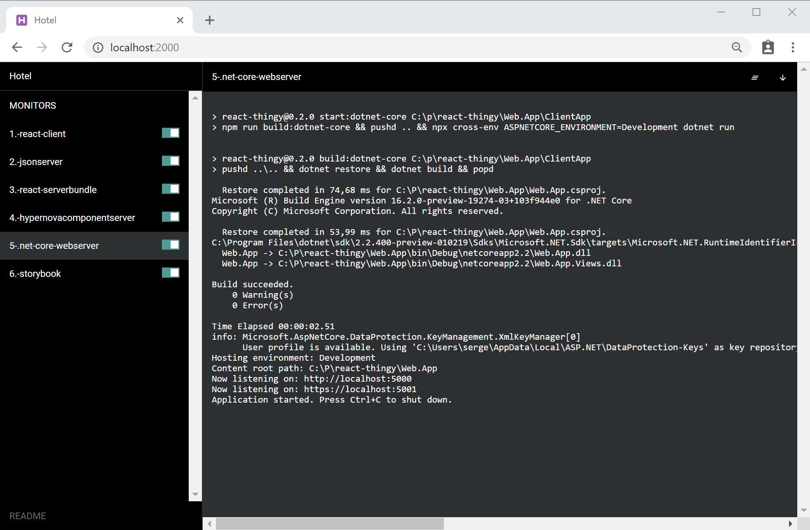

# React Thingy 

Welcome to **React Thingy**. a sample project where we combined learnings and best practices of
previous React projects we executed at Macaw Interactive, a Dutch Digital Agency. 

# The technology stack

At Macaw Interactive we made choices with respect to the front-end development technology stack that we use, and the way we build web applications. Our primary front-end technology stack consists of:

- ReactJS (using Redux where applicable)
- TypeScript
- Server-side rendering for SEO

For more information on the Macaw Interactive thoughts on technology complemented with an assessment result see the [Macaw Interactive front-end Technology Radar](https://github.com/macaw-interactive/radar).

# Why we named it React Thingy?

We don't call it a
boilerplate, a starter kit or something like that - it is the current state of best practices that
we might use for our next project (we are actually doing that right now). But for other projects
we are going to start in the future we will look at our insight in front-end development at that moment.
Things in front-end land are changing so fast! We don't want to invest in standardizing code for
all our projects because that will result in dragging a large code base into a project, where that
code must be maintained and becomes legacy the moment it is pulled in. That is why we don't give it
a hefty name, but just call it a **Thingy**.

## Features of React Thingy

The provided .NET Core 2.2 Web.App solution is a complete configured front-end development solution
containing sample code to show how it works. The solution is based on a
default .NET Core web site project (Web.App) with React as provided by the Visual Studio .NET Core
starter, but we changed the setup and configuration to extend it and to enable TypeScript for font-end
development.

The project combines the following technologies:

- A .NET Core 2.2 web application rendering a Single Page Application (SPA), Razor Pages and AMP pages
- The frontend project is bootstrapped with Create React App 3 (CRA3)
- All frontend code is written in TypeScript and checked with TSLint
- Hypernova based server-side rendering for single components, the complete SPA or AMP pages
- Server-side rendered SPA can be async, so components in the SPA can make async calls to retrieve data 
  or have promises to be resolved before rendering
- JSon Server based mock api
- Storybook to manage the design system

And the solution provides the configuration and scripts to package all this goodness into a Linux Docker 
image that can be used as unit of deployment.

## How to use this code base?

If you think this Thingy is useful then clone it and make it your own. Throw away the stuff you
don't use, modify the code you use. All the code is here - no dependencies on custom created nuget
or npm packages that makes it more difficult to change the stuff. If you find issues or have 
improvement then please give us a pull request.

## Get the solution working on your local box

Before tayloring the solution it is best to get the solution up and running on your local developer machine.
To do this you need to execute the following steps:

- Install the npm packages in the folders `Web.App/ClientApp` and `Web.App/HypernovaComponentServer` by executing the command `npm install` in these folders.
- in the folder `Web.App/ClientApp` execute the following commands:
  - `npm start` to transpile and start the front-end code on port 3000, runs in watch mode so restarts on code changes
  - `npm run start:server-bundle` to transpile the server-bundle.js, runs in watch mode so restarts on code changes
  - `npm run start:hypernovacomponentserver` to start the Hypernova based component server on port 8080
  - `npm run start:jsonserver` to start the mock server
  - `npm run start:storybook` to start Storybook for out of context component development
- Open the `Web.App.sln` solution in Visual Studio
- Right-click on the Web.App project, and select `properties`. Configure the properties on the `Debug` tab to reflect the values below, and start the debugger:



## Hotel

An easier way to start one or more of the above npm scripts is through a tool called [Hotel](https://github.com/typicode/hotel). In the folder `Web.App/ClientApp` execute the script `starthotel.bat` to start the tool. This scripts configures Hotel and opens a web browser on `http://localhost:2000` where you can start/stop any of the above mentioned npm scripts:



- Flip the switch to start/stop the npm script
- Click on the bar outside the title to see output of the script
- Click on the title in the bar to open the web browser on the specific script
  
## Configure the solution

To tailor the solution for your project there are two configuration files:

- ```envSolution.bat``` for configuring the name of your solution through the setting ```SOLUTIONNAME```.
- ```env.<USERNAME>.bat``` for user specific settings related to deployment of the Docker container. This file contains the following settings:
  - ```CONTAINERREGISTRY_URL``` - the URL of the container registry, for Azure in the format of ```<registryname>.azurecr.io```
  - ```CONTAINERREGISTRY_USERNAME``` - username for this registry
  - ```CONTAINERREGISTRY_PASSWORD``` - password for this registry

Note that all ```env.*.bat``` files are excluded from source control.

## Working with the code

To edit the .NET Core application web open the solution ```Web.App.sln```. When the project ```Web.App``` is started (development mode) it expects a SPA application running on http://localhost:3000.

Open the project at the root folder in Visual Studio Code, so NOT at the ```Web.App\ClientApp``` folder - otherwise the configured debugging settings will not work.

The folder ```Web.App\ClientApp``` contains a ```package.json``` file containing scripts
for developing and building the application. See [README development](./documentation/development.md) for more information on how to do development with the solution.

### Generating SSL certificate
If you're getting SSL certificate issues in your browser, you might need to generate a self-signed certificate. Do that using ```dotnet dev-certs https --trust``` in the ```\Web.app``` folder. Read more about it [here](https://www.hanselman.com/blog/DevelopingLocallyWithASPNETCoreUnderHTTPSSSLAndSelfSignedCerts.aspx).

## Deploying the solution

The ```Web.App``` is deployed in a Docker container that can be run locally or deployed to a hosting platform like Azure.
See [documentation on using Docker](./documentation/Docker.md) for more information on the available scripts to build and deploy the Docker image.

## Working examples

The code provides some examples that can be found at the folowing URL's when the application is running:

- ```http://localhost:3000``` - the SPA built by CRA3, running only client-side
- ```https://localhost:5001``` - the SPA running from the DotNet Core application

All parts of the sample application can be reached through the web UI.

Note that the AMP stories page does not work when running under http://localhost:3000 because AMP pages need to be rendered server-side.

## TODO

See the [TODO](./TODO.md) file for things still to be implemented in Web.App.

## Setting up an Azure DevOps project for build and deploy

Open the [Azure Portal](https://portal.azure.com) and search for **DevOps Projects**. This is one of the coolest features of the Azure Portal that enables you to set up a completely configured Azure DevOps project including Ci/CD configuration.

1. Select the **New** button
2. Select the .NET project (Next)
3. Select ASP.NET Core (Next)
4. Select Web App for Containers (Next)

In the release pipeline we want to use the existing hosting plan and registry:

```
-webAppName reactthingy -hostingPlanName linuxappserviceplan -appInsightsLocation "West Europe" -sku "S1 Standard" -registryName "svdoever" -registryLocation "West Europe" -registrySku "Standard" -imageName reactthingy:$(Build.BuildId)
```

## Learn More

You can learn more about Create React App in the [Create React App documentation](https://facebook.github.io/create-react-app/docs/getting-started).

For more information on React, check out the [React documentation](https://reactjs.org/).
