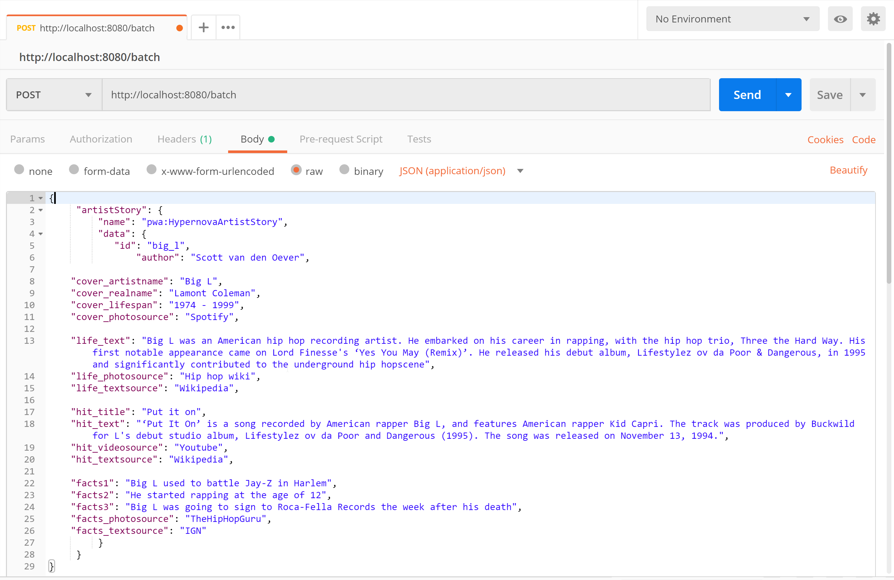

# HypernovaComponentServer

## Introduction

The HypernovaComponentServer is a server that allows you to render components over http.

## Background

The HypernovaComponentServer is built on top of the great Hypernova projects from AirBnB. In the HypernovaComponentServer we use the packages:

* [hypernova-react](https://github.com/airbnb/hypernova-react) - for rendering ReactJS based components
* [hypernova-amp](https://github.com/airbnb/hypernova-amp) - for rendering AMP pages

# Debugging the ComponentServer

The ComponentServer implementation lives in the script ```componentserver.js```. In development mode it requires the ```server-bundle.js``` file located next to the script.

In Visual Studio Code a ```.vscode/launch.json``` configuration is available to start the debugging of the ```componentserver.js``` script and the ```server-bundle.js``` script:

```json
{
    "version": "0.2.0",
    "configurations": [
        {
            "type": "node",
            "request": "launch",
            "name": "HypernovaComponentServer",
            "program": "${workspaceFolder}/componentserver.js",
            "runtimeArgs": [
                "-r",
                "source-map-support/register"
            ],
            "env": {
                "ComponentServerBundles": "{\"pwa\":\"./server-bundle.js\"}"
            },
            "runtimeExecutable": "${workspaceRoot}/Web.App/ClientApp/node_modules/.bin/nodemon",
            "restart": true,
            "console": "integratedTerminal",
            "internalConsoleOptions": "neverOpen",
            "sourceMapPathOverrides": {
                "webpack:///./~/*": "${workspaceRoot}/../Web.App/node_modules/*",
                "webpack:///./*": "${workspaceRoot}/../Web.App/*",
                "webpack:///*": "*"
            }
        }
    ]
}
```

It is possible to set breakpoints in Visual Studio Code in both the ```componentserver.js``` or any of the scripts compiled into ```server-bundle.js```.

Note that ```nodemon``` is used as runtime executable instead of ```node```, this makes sure the server is restarted when the ```server-bundle.js``` file updates.

At the top of the ```componentserver.js``` script the ```server-bundle.js``` components bundle is explicitly required, so Visual Studio Code knows how to do resolve the code. Visual Studio Code does not understand dynamically required bundles.

```javascript
let bundle_to_debug = require('./server-bundle');
if (process.env.NODE_ENV === 'production') {
    bundle_to_debug = undefined;
}
```

# Configuring the ComponentServer

The ```componentserver.js``` script is configured by the following environment parameters:

### process.env.NODE_ENV

The ```NODE_ENV``` variable can have one of two values: ```development``` or ```production```.

### process.env.ComponentServerBundles

When the ```NODE_ENV``` variable is set to ```development``` the ```ComponentServerBundles``` variable is ignored and the
```server-bundle.js``` bundle next to the ```componentserver.js``` script is used. This bundle is the only loaded bundle, so for all component render calls the specified bundle is ignored. 

When the ```NODE_ENV``` variable is set to ```development``` the ```ComponentServerBundles``` variable specifies the bundles to be loaded. Bundles can be either relative to the ```componentserver.js``` script or uri addressable bundles over http or https.

Example configuration of multiple bundles:

```json
{ "default": "./default-bundle","pwa": "./pwa-bundle", "remote": "http://myserver.com/remote-bundle.js" }
```
# Postman
The HypernovaComponentServer can be easily tested through [Postman](https://www.getpostman.com/).
The server is started on ```http://localhost:8080``` and can be reached on the ```/batch``` end-point. Make sure that the header ```Content-Type``` is set to ```application/json```.

For example to render the 



# Docker

The best way to do a deployment of the HypernovaComponentServer is in a Docker image. The HypernovaComponentServer project contains the scripts to build, run and deploy the hypernovacomponentserver image.

* ```BuildockerImage.bat (development|production)``` - builds the ```hypernovacomponentserver:1.0.0``` image. There are two types of images that can be built:
  * ```BuildockerImage.bat development``` is a fast build of the image that can be used to run locally
  * ```BuildockerImage.bat production``` is a (slower) build of the image that can be used to deploy to an Azure Linux Web App. This image contains an SSH server that makes t possible to connect from the Azure Web App UI over Web SSH to the running container.

  Note 1: by default a production build is done.

  Note 2: The ```server-bundle.js``` is created from the ```BuildockerImage.bat``` script. Depending on the development or production modus a development or production version of the *server-bundle.js``` is created.

* ```RunDockerImageLocal.bat``` - run the ```hypernovacomponentserver:1.0.0``` as a container on http://localhost:8080. It is executed with the following parameters:
  * ```-e ComponentServerBundles={"pwa":"./server-bundle.js"}``` - so we use the ```server-bundle.js``` in bot the development and production version of the image running in the container.
  * ```--network bridge``` - so from the container we can access the local computer over IP address. This is useful when we need to do a service call to the host computer. It is not possible from a linux Docker container running on Windows to access a website on the host by hostname, always use http://[ip-address]:[port].

# Configuring the hypernovacomponentserver image

# Deploying the hypernovacomponentserver image on Azure
