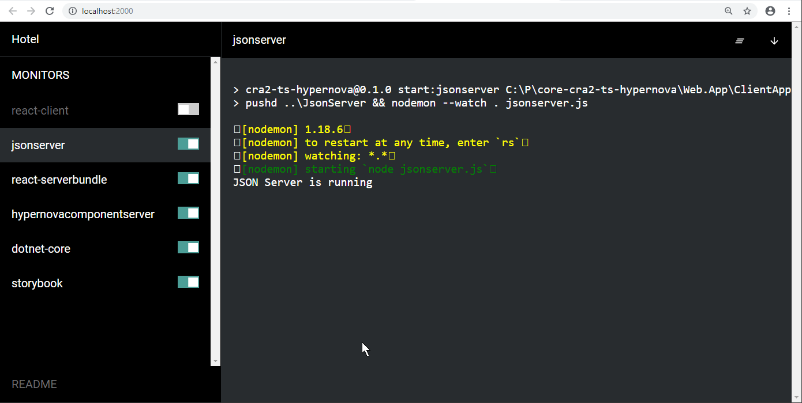

# Development

It is assumed that the following IDE's are used in development of the web application:

- Visual Studio 2019 - for .net core C# development (although this can be done in Visual Studio Code as well)
- Visual studio Code - for front-end development

## Package.json scripts and Hotel

When doing development many scripts come into play to start the different subsystems that have to run at the same time. The
```Web.App\ClientApp\package.json``` file contains individual scripts to run these subsystems.

The following scripts are relevant while developing:

- **Client-side React web application**: ```npm start``` - Start the Create React App 2 front-end development transpilation. Creates a running
  client-side React application running on port 3000.

- **Jsonserver**: ```npm run start:jsonserver``` - Start the jsonserver mock web server. Jsonserver runs on port 3001.

- **Web server**: ```npm run start:dotnet-core``` - Compile and run the dotnet core web server. The web server runs on port 5000 (http) and 5001 (https).

- **HypernovaComponentServer**: ```npm run start:hypernovacomponentserver``` - Start the HypenovaComponentServer with the ```server-bundle.js``` 
  as created by ```npm run start:serverbundle```. The HypernovaComponentServer runs on port 8080.

- **Server bundle compilation**: ```npm run start:server-bundle``` - (Re)build the ```server-bundle.js``` as required by the HypernovaCompnentServer.
  On any change in the ```Web.App\ClientApp\src``` folder the server bundle is rebuilt.

- **Storybook**: ```npm run storybook``` - Start the Storybook server on port 9001.

Although it is possible to combine two or more of the above scripts into one script and run them in parallel, there are a few downsides to this approach:

- Output of multiple scripts will be mized into one terminal output window
- It is difficult to predict which scripts to combine because often one of the scripts is actually executed in the debugger

To make it easy to select visually which scripts to run the visual tool [Hotel](https://www.npmjs.com/package/hotel) is used to
manage the scripts to run.

In order to be able to use hotel it must be globally installed: ```npm install -g hotel```.

Run the script ```Web.App\ClientApp\starthotel.bat``` to start The Hotel tool - a web based interface to control all subsystems. With a flip of a switch the different scripts can be started or stopped.



## Easy fixing compilation errors

The ```npm start``` command provides direct links to the source files when executed in a Visual Studio Code integrated terminal, so often it is
easier to run it from Visual Studio Code than from the Hotel web UI. Make sure that the ```starthotel.bat``` script is started before running
```npm start``` bacause the ```starthotel.bat``` script will kill the application that is using port 3000 (Visual Studio Code in that case).

Even easier is the **PROBLEMS** tab in Visual Studio Code, because it provides links directly to the correct line in the correct file in case
of compilation errors.

## Debugging

The following subsystems do often require debugging:

- **Client-side React web application**: make sure that ```npm start``` is running (**react-client** in Hotel), then select *Chrome on http://localhost:3000*
  in the Visual Studio Code debugger.

- **Web server (C#)**: make sure that  ```npm run start:dotnet-core``` is not running (**dotnet-core** in Hotel), then start debugging of ```Web.App``` in Visual Studio 2019.
  It is also possible to debug from Visual Studio Code by selecting *Web.App* in the Visual Studio Code debugger.

- **Client-side code as served by the Web server**: make sure that the web server is running (either through Hotel or in debugging mode), then select
  *Chrome on https://localhost:5001* in the Visual Studio Code debugger. This way it is possible to debug the client-side code in the real situation over https.

- **HypernovaComponentServer + server-side rendered React code**: make sure that ```npm run start:serverbundle``` is running to respond on changes in the code, otherwise the   latest created ```server-bundle.js``` will be used, then select *HypernovaComponentServer* in the Visual Studio Code debugger. It is possible to set breakpoints in the
  React code and in the ```Web.App\HypernovaComponentServer\componentserver.js``` script.

## Docker commands

The web application **Web.App** is deployed as a Docker container. The ```Docker``` solution folder contains batch files to start the different Docker image
related actions like:


To run these scripts directly from the Visual Studio solution explorer install the Visual studio 
extension [Open Command Line](https://marketplace.visualstudio.com/items?itemName=MadsKristensen.OpenCommandLine)

# Debugging
Install nodemon (```npm install nodemon -g```)

# Visual Studio Code extensions
**Debugger for Chrome** extension

# Production deployment checklist

## Remove css and js map files
In the creation of the JavaScript and CSS bundles by Create React App ```.map``` files are created.
These are used during debugging and provide a full source code view in the Chrome developer tools.
There is even a plugin TODO:name of plugin to recreate all source files from the map files.
When it is important to protect the source code in the production deployment the map files
and references to the map files must be removed. Preferably in the release pipeline so the same
build result can be used for dev, test and production. See https://github.com/facebook/create-react-app/issues/1341 for a discussion on this topic.
